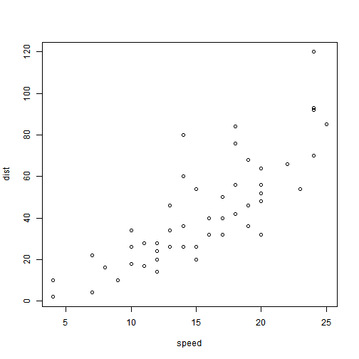

## Slide 1: Introduction

This is a simple web app.

This app predicts if you will receive an answer to your question on [Stackoverflow](http://stackoverflow.com), based on your: 
- badges
- reputation
- votes
- views
- tags


---

## Slide 2:  Data

To construct this algorithm I 
- used the OXPath data extraction language to scrape approximately 1,700 questions (with answer counts) from Stackoverflow
- tidied up the data 
- ran a Random Forest to classify the questions based on the outcomes (answers) 

My methodology for sampling questions was to focus on questions tagged with R and to sample 50 questions from each 100 pages of questions from present to the oldest questions archived by Stackoverflow, where each page of questions contained 50 questions. 

-- 

## Slide 3: Instructions

Simply update the values in the sidepanel to reflect 

- your number of badges (bronze, silver, and gold)
- reputation points
- the number of views and votes already received

Note that the data used to train my classifer were largely questions that contained (at least) an R tag, so de-selecting the R tag may lead to less accurate predictions.


## Slide 4: How it Works

We start by reading in a randomForest model developed in analysis.R and the first row of the training dataset.

```r
  x      <- readRDS("x.rds")
  rf     <- readRDS("rf.rds")
  userdf <- x[1,]
  dim(userdf)
```

```
## [1]    1 1033
```

```r
  head(colnames(userdf))
```

```
## [1] "votes"       "reputation"  "views"       "bron_badges" "silv_badges"
## [6] "gold_badges"
```

Then I use the UI to reactively update the values of this one row dataframe and predict an outcome.

## Slide 5: Performance

The performance of my algorithm was moderately good. With only 50 trees I had 81% accuracy. In the future I intend to integrate text mining of the question titles and bodies to boost performance.

 
